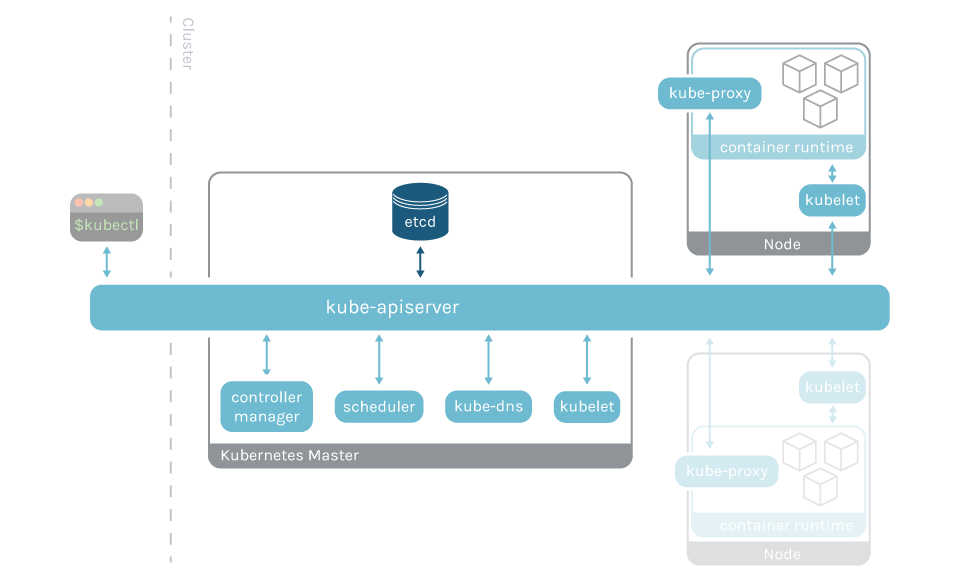

#  k8s-learning

### Kubernetes is not a “CI/CD”, “Micro-service” focused container cloud 

- kubernetes is a portable, extensible, open-source platform for managing containerized workloads and services. 
  It facilitates both declarative configuration and automation, 
  letting us run distributed system resiliently that scale to meet users’ demand.
- kubernetes (k8s) is an open-source platform for containerized application deployment, automation, management, and scaling. 
- Kubernetes groups containers into logical clusters for easy management and discovery. K8S can operate both in cloud and 
  on-premise environments, including hybrid clouds. 
  
### Key features of Kubernetes include:

  #### Load Balancing and Service Discovery: 
      - Automatically assigns DNS names, IP addresses, and load-balances to pods.

  #### Automatic Bin Packing: 
      - Ensures the availability and optimization of resources by placing containers based on 
        their resource requirements.

  #### Self-Recovery: 
     - Restarts failed containers, replaces containers after node failures, and removes containers 
       that fail health checks.

  #### Rollout and Rollbacks Automation: 
     - Rolls back to previous versions when issues occur and prevents system failure by 
       running modifications.

  #### Batch Execution and Scaling: 
     - Enables you to scale applications manually or automatically and manages batches and 
       Continuous Integration (CI) workloads.

### Kubernetes is a  declarative platform

####   - brain for your distributed container deployment
####   - Container Centric DevOps/Workload Orchestration System   
####   - Platform for building Platforms 

      
### k8s components         
 
 
