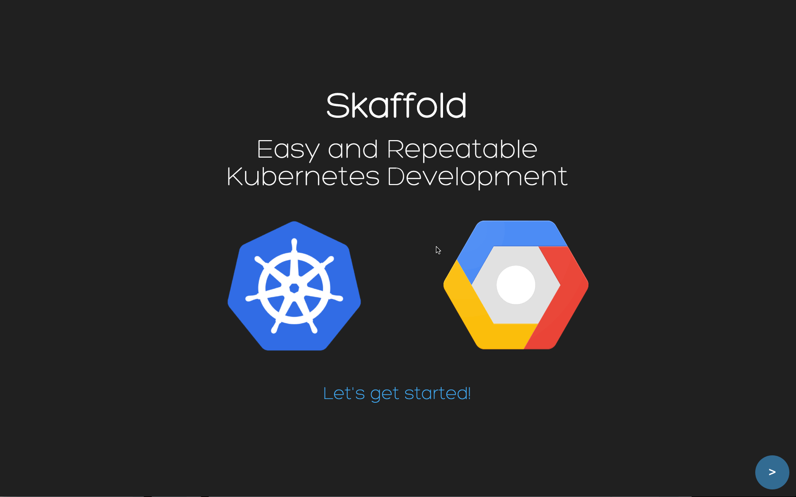

1. [Install Skaffold](https://skaffold.dev/docs/install/)
2. [Quick Start](https://skaffold.dev/docs/quickstart/)
3. [CI/CD](https://skaffold.dev/docs/workflows/ci-cd/)

Skaffold is a command line tool that facilitates continuous development for
Kubernetes applications. You can iterate on your application source code
locally then deploy to local or remote Kubernetes clusters. Skaffold handles
the workflow for building, pushing and deploying your application. It also
provides building blocks and describe customizations for a CI/CD pipeline.

## Features

* Blazing fast local development
  * **optimized source-to-deploy** - Skaffold detects changes in your source code and handles the pipeline to
  **build**, **push**, and **deploy** your application automatically with **policy based image tagging**
  * **continuous feedback** - Skaffold automatically aggregates logs from deployed resources and forwards container ports to your local machine
* Project portability
  * **share with other developers** - Skaffold is the easiest way to **share your project** with the world: `git clone` and `skaffold run`
  * **context aware** - use Skaffold profiles, user level config, environment variables and flags to describe differences in environments
  * **CI/CD building blocks** - use `skaffold run` end-to-end, or use individual Skaffold phases to build up your CI/CD pipeline. `skaffold render` outputs hydrated Kubernetes manifests that can be used in GitOps workflows.
* Pluggable, declarative configuration for your project
  * **skaffold init** - Skaffold discovers your files and generates its own config file
  * **multi-component apps** - Skaffold supports applications consisting of multiple components
  * **bring your own tools** - Skaffold has a pluggable architecture to integrate with any build or deploy tool
* Lightweight
  * **client-side only** - Skaffold has no cluster-side component, so there is no overhead or maintenance burden
  * **minimal pipeline** - Skaffold provides an opinionated, minimal pipeline to keep things simple

### Check out our [examples page](https://github.com/GoogleContainerTools/skaffold/tree/master/examples) for more complex workflows!
