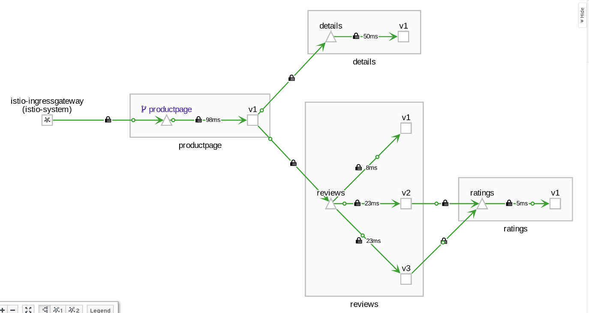

# MTLS Configuration


## Download istioctl

```bash
curl -L https://istio.io/downloadIstio | sh -
cd istio-X.X.X/bin
sudo chmod +x istioctl
sudo mv istioctl /usr/local/bin
```

## View current configuration


```bash
istioctl authn tls-check productpage-v1-8554d58bff-x8gdp.bookinfo | grep .bookinfo
HOST:PORT                                       STATUS     SERVER        CLIENT     AUTHN POLICY     DESTINATION RULE
details.bookinfo.svc.cluster.local:9080         OK         HTTP/mTLS     HTTP       default/         -
productpage.bookinfo.svc.cluster.local:9080     OK         HTTP/mTLS     HTTP       default/         -
ratings.bookinfo.svc.cluster.local:9080         OK         HTTP/mTLS     HTTP       default/         -
reviews.bookinfo.svc.cluster.local:9080         OK         HTTP/mTLS     HTTP       default/         -

```

## Apply MTLS policy and destination rule

Namespace-wide

```yaml
kubectl apply -f - <<EOF
apiVersion: "authentication.istio.io/v1alpha1"
kind: "Policy"
metadata:
  name: "default"
  namespace: "bookinfo"
spec:
  peers:
  - mtls: {}
---
apiVersion: "networking.istio.io/v1alpha3"
kind: "DestinationRule"
metadata:
  name: "default"
  namespace: "bookinfo"
spec:
  host: "*.bookinfo.svc.cluster.local"
  trafficPolicy:
    tls:
      mode: ISTIO_MUTUAL
EOF
```



```bash
istioctl authn tls-check productpage-v1-8554d58bff-x8gdp.bookinfo | grep .bookinfo
HOST:PORT                                       STATUS     SERVER        CLIENT     AUTHN POLICY     DESTINATION RULE
details.bookinfo.svc.cluster.local:9080         OK         mTLS          mTLS       default/bookinfo     default/bookinfo
productpage.bookinfo.svc.cluster.local:9080     OK         mTLS          mTLS       default/bookinfo     default/bookinfo
ratings.bookinfo.svc.cluster.local:9080         OK         mTLS          mTLS       default/bookinfo     default/bookinfo
reviews.bookinfo.svc.cluster.local:9080         OK         mTLS          mTLS       default/bookinfo     default/bookinfo
```
